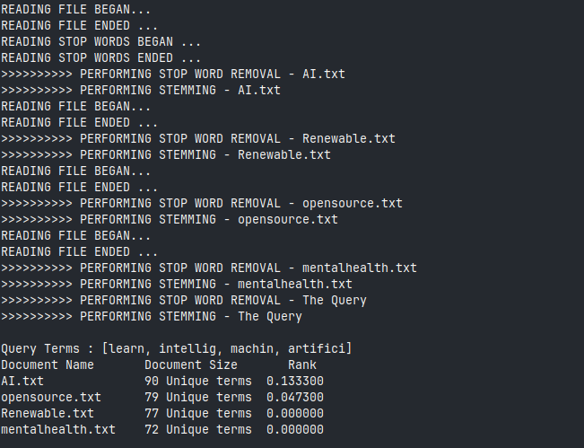

# Vector Space Model

## Overview

This project is a vector space model implementation in Java that ranks given files based on the revelance to a given query. The project uses the Vector Space Model (VSM) to compute the relevance of text documents to a given search query. 

## Prerequisites

- Java Development Kit (JDK) 8 or higher
- Maven

## Installation

1. **Clone the repository:**
   ```bash
   git https://github.com/firo1919/Vector-space-model.git
   cd Vector-space-model
   ```

2. **Build the project:**
   ```bash
   mvn clean compile assembly:single
   ```

## Usage

To run the project, use the following command while being inside the directory:

```bash
java -jar target/*.jar <file1> <file2> <file3> ... -t "<query>"
```

### Example

```bash
java -jar target/*.jar ~/Downloads/AI.txt ~/Downloads/Renewable.txt ~/Downloads/opensource.txt ~/Downloads/mentalhealth.txt -t "artificial intelligence and machine learning"
```

In this example, the program will rank the files `AI.txt`, `Renewable.txt`, `opensource.txt`, and `mentalhealth.txt` based on the relevance to the query "artificial intelligence and machine learning" and outputs it to the console.


